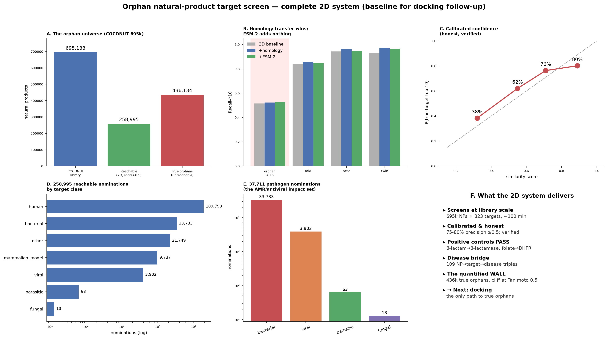
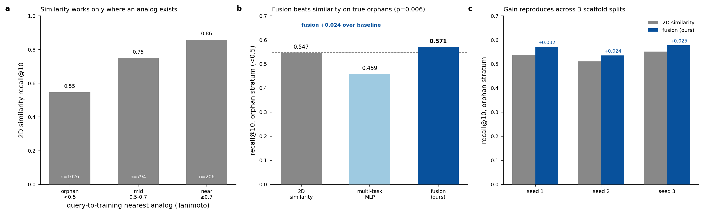
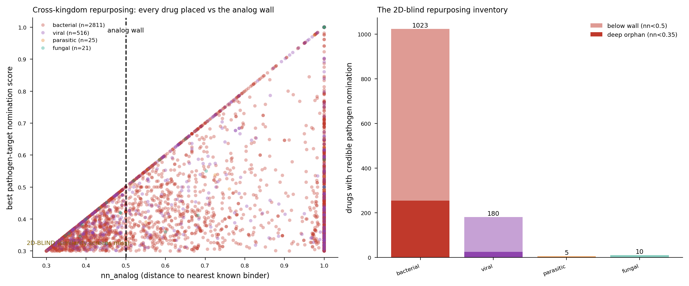
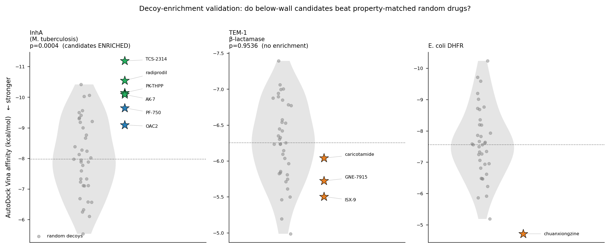
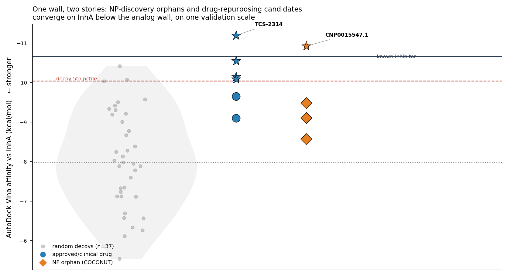
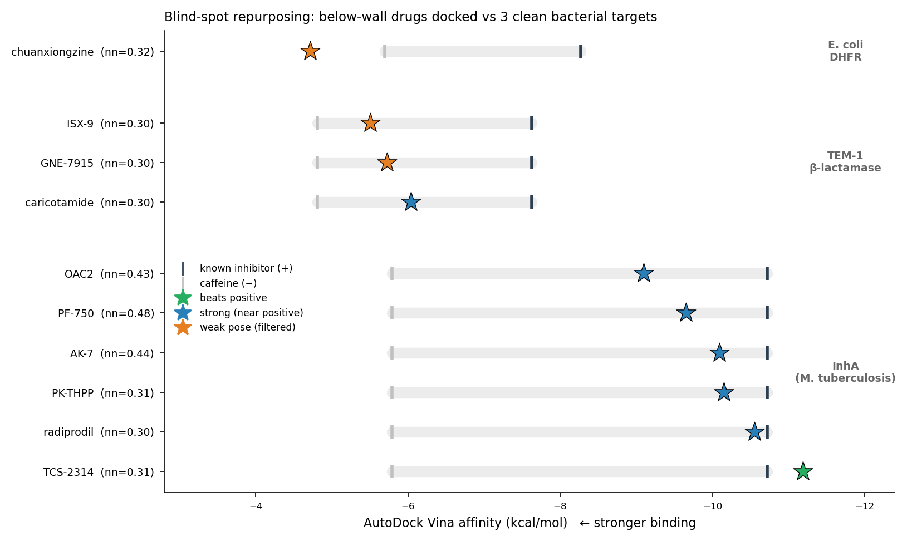
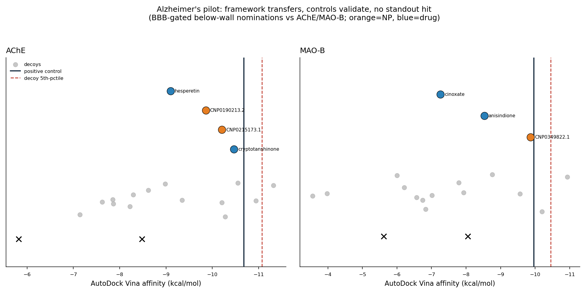

# Reliability-aware target nomination reveals resistance-robust natural-product candidates against priority pathogens

James K. Martin II, PhD^1,*^

^1^ Department of Medical Education and Scholarship, Rowan-Virtua School of Osteopathic Medicine, Stratford, NJ, USA

*Correspondence: martiniij@rowan.edu

*Preprint, not peer reviewed.*

## Abstract

Ligand-based target prediction relies on 2D molecular similarity, which fails silently for compounds with no close analog and says nothing about whether a nominated antimicrobial target survives resistance mutations. We address both gaps in one reliability-aware framework. Across COCONUT 2.0 (695,133 natural products) roughly 63% of chemical space has no annotated analog within Tanimoto 0.5, a source-independent boundary we call the analog wall; on the true structural-orphan stratum (n = 1,026) a per-compound fusion of similarity and a neural predictor reaches recall@10 = 0.571 versus 0.547 for similarity alone (McNemar p = 0.006, three scaffold-disjoint splits). Every nomination carries its distance to the nearest analog and is promoted only after property-matched decoy enrichment and catalytic-contact geometry. Following the framework onto its targets, a repurposed-drug series and a structural-orphan natural product converge on *M. tuberculosis* InhA (orphan CNP0015547.1 docks −10.9 kcal/mol, beats the control, clears all 37 decoys, corroborated by Boltz-2 co-folding). On DHFR the resistance question arises: rigid docking is blind to it (ΔΔG ≈ 0 for drugs against their own resistance mutations), so we built a curated mutant-aware database (10 pathogen targets, 76 mutations, all X-ray) and a control-validated ΔΔG layer that recovers resistance leave-target-out. Screening 163 orphans over 626 ligand–mutation pairs nominates natural products predicted more resistance-robust than the front-line drug. The framework refuses cleanly when structure cannot support a lead, and transfers to CNS targets at library scale. The contribution is integration, a quantified applicability domain, and a resistance-aware extension no existing resource provides, delivered as ranked hypotheses for follow-up.

## 1. Introduction

Ligand-based target prediction underpins much of computational drug repurposing: if a query compound is structurally similar to a molecule with a known target, the target is inferred by transfer. Methods built on this premise (nearest-neighbor similarity searching, similarity-ensemble approaches, and their descendants) are fast, interpretable, and effective when a close analog exists [1]. Reverse (target-fishing) docking such as TarFisDock and its successors [2] offers a complementary, structure-based route, and cold-start deep learning for drug–target interaction attempts to generalize to unseen chemistry. These are prior art and a reader will already know them; we do not claim to improve on any of them algorithmically.

The problem we address is a blind spot all similarity-transfer methods share and rarely quantify: they degrade precisely for compounds with no near analog, yet report a nomination anyway. Natural products are the acute case. Many are well documented pharmacologically but lack a co-crystallized target, and a large fraction occupy chemical space with no close relative in target-annotated databases. A method silent about its own applicability domain will hand a confident-looking target to exactly the compounds for which it is least reliable. A second blind spot is specific to anti-infectives: even a correct target nomination says nothing about whether the compound will still bind once the pathogen mutates the pocket, which is the failure mode that ends antibiotics in the clinic.

This paper is organized around a single instrument and the targets it reaches. We first build the instrument and show what it can and cannot do in principle: we quantify the analog wall, show that a reliability-aware fusion extracts a small but real edge on true orphans where a naive neural model degrades, and demonstrate that a decoy-referenced structural filter rejects nominations on the wrong target. We then let the instrument choose targets and follow it there. It converges on InhA from two independent directions. It rediscovers folate-pathway chemistry on DHFR, where the resistance question forces the framework's central extension: because rigid docking cannot see resistance, we add a curated mutant-aware target database and a control-validated ΔΔG layer, then screen natural-product orphans for resistance-robust binding across the priority pathogen targets that yield a scorable complex (nine of the ten in the database). Finally we show the instrument refuses cleanly when the structure cannot support a lead, and that it ports beyond antimicrobials. The through-line is not a particular hit; it is an instrument that knows when it is guessing, and now knows when a target will slip away under resistance.

## 2. Methods

The pipeline runs in three stages (Figure 1): annotate every compound with its distance to the nearest annotated analog, nominate protein targets with a reliability score, and validate below-wall candidates structurally against property-matched decoys. Sections 2.10–2.12 add the resistance-aware extension.

**Figure 1. Framework overview.** Pipeline schematic: library, analog-wall annotation, reliability-aware nomination, and decoy-referenced structural validation.

### 2.1 Chemical libraries and the analog wall

Natural-product structural space was surveyed using COCONUT 2.0 (695,133 natural products) [3]. For every compound we computed the nearest-neighbor Tanimoto similarity (`nn_analog`) to the target-annotated benchmark set using RDKit Morgan fingerprints (radius 2, 2,048 bits). We define the **analog wall** at Tanimoto ≈ 0.5: compounds with `nn_analog < 0.5` are "below the wall" (no close annotated analog), and those below 0.35 are deep structural orphans. Approximately 63% of COCONUT are true structural orphans by this criterion. The gap is source-independent: the same below-wall population reproduces on independent natural-product collections (NP Atlas [4], CMAUP [5] gap compounds), so it is a property of natural-product chemistry rather than of one database's coverage.

### 2.2 Benchmark and learnable targets

The learnable benchmark comprises 15,418 known compound–target pairs spanning 9,259 distinct compounds and 319 protein targets with at least 5 annotated binders each (the minimum for a learnable per-target model). Bioactivity pairs were drawn from a curated Kd/affinity subset of ChEMBL [6] and BindingDB. Compounds were represented by 2,048-bit Morgan fingerprints; targets by frozen ESM-2 [7] protein-language-model embeddings.

### 2.3 Target-nomination models

Three predictors were compared on identical inputs:
1. **Similarity transfer**: nearest-neighbor Tanimoto vote over annotated binders (the standard ligand-based baseline).
2. **Multi-task MLP**: a shared-representation neural classifier over the 319 targets, trained on the benchmark pairs.
3. **Per-compound fusion**: a naive rank fusion of (1) and (2) computed independently for each compound, learning no additional parameters.

We evaluated on the **true structural-orphan stratum** (`nn_analog < 0.5`, n = 1,026 held-out compounds) because this is the region where similarity transfer is expected to fail and where any added value must appear. The primary metric is recall@10 (fraction of compounds whose true target is in the top 10 nominations). Statistical comparison between the fusion and the similarity baseline used McNemar's test on paired per-compound hit/miss outcomes. Robustness was assessed on three scaffold-disjoint train/test splits (Bemis–Murcko [8] scaffolds fully partitioned between train and test, so no test scaffold is seen in training).

We tested ESM-2 embeddings as an auxiliary target feature. Over a baseline of 2D fingerprints plus homology-based target transfer, ESM-2 added no measurable recall on the orphan stratum, so it is not part of the reported nomination score (it is retained only for target representation in the multi-task model).

### 2.4 Drug-repurposing screen

8,780 approved and clinical-stage drugs were scored against the 319 learnable targets, producing 131,700 retained drug–target predictions. Each drug was annotated with its `nn_analog`, its wall side (above/below 0.5), its orphan depth (edge 0.45–0.5, mid 0.35–0.45, deep < 0.35), and the organism class of the nominated target (bacterial/viral/fungal/parasitic). A drug was recorded as carrying a *credible pathogen nomination* when its best-scoring pathogen target passed the calibrated score threshold; 3,373 drugs met this bar and constitute the repurposing map (one nomination per drug).

### 2.5 Natural-product orphan screen and target-to-disease bridge

The discovery arm is the mirror image of the repurposing screen. We nominated targets for 258,995 COCONUT natural products (those reachable by the nomination model), producing per-compound ranked target lists over 287 protein targets, each annotated with `nn_analog` and the calibrated confidence. To turn a target nomination into a disease-level hypothesis, we mapped nominated targets to diseases through Open Targets [13] and known pathogen-target associations, yielding 1,134 target–disease triples across 234 targets. Selected true-orphan nominations were advanced to structural validation (2.6) against their own nominated targets, so that the compound is docked against the target the pipeline chose for it rather than a pre-selected one.

### 2.6 Structural validation: reverse docking and decoy enrichment

Candidates advancing to structural validation were docked with AutoDock Vina 1.2.7 [9]. Receptor identity and binding-site definition were fixed using SIFTS/PDBe [11] residue mappings, and docking boxes were centered on the annotated catalytic/orthosteric site. For each target we assembled a property-matched decoy set (37 decoys matched on molecular weight) to estimate a null docking-score distribution. A candidate was called **enriched** when its Vina affinity fell in the top tail of the decoy distribution; we report per-candidate z-scores, the count of decoys scoring stronger, and a group-level Mann-Whitney enrichment p-value comparing candidate affinities against decoys. Each candidate was paired with a positive control (a known binder) and a negative control. Pose plausibility was assessed by pocket centroid-to-box distance and by explicit contact with catalytic residues (for example, InhA Tyr158 and Lys165).

### 2.7 Negative and experimental controls

Two negative-control targets tested filter specificity: TEM-1 β-lactamase and *E. coli* dihydrofolate reductase, each challenged with below-wall candidates that should not be enriched. As an experimental null for the target-to-phenotype step, we used a pure whole-cell antimicrobial slice from CO-ADD [12] (n = 156 drugs; 42 active, 114 inactive) and tested whether the nomination score separates phenotypic actives from inactives by Mann-Whitney U.

### 2.8 Orthogonal structural confirmation: co-folding

To test whether the InhA poses survive an independent structural method, we co-folded InhA (UniProt P9WGR1, 269 residues) with each of the top repurposing candidates and the natural-product orphan using Boltz-2 [14], which predicts the protein–ligand complex *ab initio* rather than docking into a pre-defined pocket. We report the interface confidence (ligand-ipTM) as an orthogonal, docking-independent measure of pose plausibility, and treated the Boltz-2 affinity module output separately because it did not discriminate our compounds.

### 2.9 Generalization test: CNS target port and library-scale screen

To test whether the reliability-aware protocol transfers beyond antimicrobial targets, we ported it to two central-nervous-system enzymes with approved-drug co-crystals: acetylcholinesterase (AChE; PDB 4EY7, donepezil co-crystal) and monoamine oxidase B (MAO-B; PDB 2V5Z, safinamide co-crystal). Because CNS activity requires brain penetration, we added a blood–brain-barrier (BBB) gate *before* nomination: a random-forest classifier on 2,048-bit Morgan fingerprints trained on the MoleculeNet [15] BBBP benchmark (2,039 molecules; held-out ROC-AUC 0.893, balanced accuracy 0.829). Only predicted-permeant molecules were nominated. Docking against 4EY7/2V5Z used the same Vina 1.2.7 setup, boxes centered on the co-crystal ligand (24 Å cube), with the approved co-crystal ligand as positive control, non-CNS molecules as negative controls, and property-matched decoys. We then applied the full pipeline to a library of 1,736,189 unique compounds drawn from ZINC [16] 2D tranches selected for CNS-like physicochemistry (MW 300–350, logP 2–3), to test whether the pipeline's behavior is stable at library scale.

### 2.10 Mutant-aware target database

To ask whether a nominated antimicrobial target remains druggable under resistance, we curated a database of 10 priority pathogen targets spanning the WHO/CDC critical set: *M. tuberculosis* InhA (P9WGR1, PDB 4TZK), RpoB (P9WGY9, 5UHC), KatG (P9WIE5, 2CCA), GyrA (P9WG47, 5BS8) and GyrB (P9WG45, 5BS8); *S. aureus* PBP2a/MecA (P07944, 4DKI) and GyrA (P20831, 2XCT); *K. pneumoniae* KPC-2 carbapenemase (Q9F663, 2OV5); and *E. coli* DHFR (P0ABQ4, 1RX3) and TEM-1 β-lactamase (P62593, 1BTL). Every target is backed by an experimental X-ray crystal structure (no predicted models were used). We compiled 76 clinically annotated resistance mutations from the literature (DOIs CrossRef-verified), of which 54 are pocket-lining (Cα within 8 Å of the bound-ligand centroid in the reference structure). Each mutation carries its provenance (source structure and reference).

### 2.11 Resistance ΔΔG scoring layer

Rigid-receptor docking scores the wild-type pocket and, as we show in Results, does not register the affinity loss caused by resistance mutations. We therefore trained a mutation-aware binding-change (ΔΔG) predictor of the mCSM-lig class: graph-based structural signatures of the wild-type protein–ligand complex around the mutated residue (concentric 4/6/8 Å shells) plus ligand physicochemical descriptors, regressed with gradient-boosted trees on the Platinum mutation–affinity database [17], following the mCSM-lig approach [18]. Positive ΔΔG denotes weaker binding (a resistance liability). The model was evaluated by random split, leave-target-out, and leave-protein-out cross-validation, and gated on a hard positive-control requirement: known antimicrobial drugs must be predicted to lose affinity to their own clinically documented resistance mutations before any natural-product score is trusted.

### 2.12 Mutant-selective orphan screen

For each target we selected below-wall natural-product orphans leaning toward that target (`nn_analog` 0.30–0.50, top ~15 per target by similarity to known binders), 163 candidates in total, plus per-target positive controls and front-line drugs. Nine of the ten database targets yielded scorable docked complexes and enter the screen; *S. aureus* PBP2a/MecA did not dock to a scorable pose and was excluded from scoring. Each ligand was docked into the wild-type pocket (Vina 1.2.7, catalytic-site box) and the docked pose merged with the receptor into a complex, which the ΔΔG layer scored against every pocket-lining mutation of that target. A candidate is flagged **resistance-robust** when it binds the wild-type pocket and its predicted worst-case ΔΔG across mutations is at or below that of the target's front-line drug control.

### 2.13 Software

RDKit (Morgan fingerprints, scaffold decomposition, ETKDG 3D embedding), `fair-esm` (ESM-2 embeddings), AutoDock Vina 1.2.7 (docking), Open Babel 3.1.1 [10] (ligand/receptor preparation), Boltz-2 (co-folding), gradient-boosted trees (ΔΔG layer), a random-forest BBB classifier, SIFTS/PDBe (receptor identity), and standard SciPy statistics. All code and intermediate tables are released (Section 7).

## 3. Results

The results move in three parts. Part I builds the instrument and bounds what it can do: the wall it must cross (3.1), the edge it extracts on true orphans (3.2), the inventory that motivates going structural (3.3), and the proof its structural filter rejects wrong targets (3.4). Part II follows the instrument onto its targets: the InhA convergence (3.5), the DHFR discovery that opens the resistance question and its answer (3.6), the resistance extension generalized across nine scored pathogen targets (3.7), and the cases the instrument correctly refuses (3.8). Part III shows the same protocol transfers beyond antimicrobials (3.9).

### Part I. The instrument: how far similarity reaches, and how to read past it

### 3.1 The similarity wall is a real, source-independent boundary

Across COCONUT 2.0 (695,133 compounds), roughly 63% of natural products have no annotated analog within Tanimoto 0.5 (Figure 2). The distribution is not an artifact of one database: the same below-wall fraction reproduces on NP Atlas and CMAUP gap compounds. Because ligand-based transfer is only as good as its nearest annotated neighbor, this majority of natural-product space is, by construction, the domain where a 2D pipeline is least reliable and yet gives no warning. Everything that follows is about operating deliberately in that domain rather than pretending it does not exist.

**Figure 2. The analog wall and the 2D system.** Nearest-neighbor Tanimoto distribution across COCONUT 2.0 showing the ≈0.5 wall and the ~63% structural-orphan majority.

### 3.2 A reliability-aware fusion recovers a small, reproducible edge on true orphans

If the wall is where methods fail, the first question is whether anything can be recovered past it. On the true structural-orphan stratum (`nn_analog < 0.5`, n = 1,026), similarity transfer achieves recall@10 = 0.547 and the multi-task MLP alone is worse (0.459): a neural predictor does not, on its own, beat nearest-neighbor voting for orphans. Their per-compound fusion reaches recall@10 = 0.571, a +0.024 absolute gain over similarity that is statistically reliable (McNemar p = 0.006; 51 compounds rescued by fusion vs. 26 lost). The gain reproduces across three scaffold-disjoint splits (+0.032, +0.024, +0.025), so it is not a single-split accident (Figure 3). The result is deliberately modest: the value of the instrument is not a large accuracy jump but that it flags orphan status explicitly and still extracts a defensible signal where the naive neural model degrades.

**Figure 3. Method capstone.** Fusion vs. similarity vs. multi-task MLP on the true-orphan stratum (recall@10 = 0.571 / 0.547 / 0.459; McNemar p = 0.006; reproducible across three scaffold-disjoint splits).

### 3.3 The blind spot the wall creates: 1,218 credible nominations live below it

The wall is not an abstraction; it hides a concrete inventory. Of 3,373 drugs carrying a credible pathogen-target nomination, 2,155 sit above the analog wall and **1,218 sit below it** (Figure 4). This below-wall set, the "2D-blind inventory," is what a similarity-only pipeline would miss or mis-rank. It is overwhelmingly antibacterial: 1,023 bacterial, 180 viral, 10 fungal, and 5 parasitic nominations, with a deep-orphan core of 282 drugs (`nn_analog < 0.35`) that has essentially no annotated structural relative. Because these nominations cannot be trusted on similarity alone, they are exactly the compounds that must be tested structurally, which is what Part II does.

**Figure 4. The repurposing blind spot.** Inventory of 3,373 credible pathogen nominations partitioned by the analog wall: 2,155 above vs. 1,218 below (282 deep orphans), with the below-wall set dominated by antibacterial nominations.

### 3.4 The structural filter rejects nominations on the wrong target

Before trusting any structural positive, we confirmed the docking/enrichment filter rejects what it should (Figure 5). Against TEM-1 β-lactamase, three below-wall candidates showed no enrichment (group Mann-Whitney p = 0.95; all with 24–33 of 37 decoys scoring stronger). Against *E. coli* DHFR used as a negative control, the candidate chuanxiongzine ranked *below* the decoy median (37 of 37 decoys stronger; z = +2.61). The instrument does not manufacture hits on the wrong target, so a positive that clears this bar carries weight.

**Figure 5. Three-target decoy enrichment.** Candidate Vina affinities against property-matched decoy null distributions for InhA (enriched, p = 0.0004) and the negative controls TEM-1 β-lactamase (p = 0.95) and *E. coli* DHFR (candidate below decoy median).

### Part II. What the instrument finds, told target by target

With the wall quantified, an orphan edge established, and the structural filter shown to reject wrong targets, we let the framework choose targets and follow it there. Two questions organize this part. Do the discovery and repurposing directions ever meet on one target (InhA, 3.5)? And when the framework lands on an antimicrobial target, will that target survive resistance (DHFR onward, 3.6–3.7)?

### 3.5 InhA: discovery and repurposing converge on one validated pocket

The framework's most arresting behavior is that its two directions, a drug-repurposing-library compound seeking a new pathogen target and a natural-product orphan seeking any target, independently nominate *M. tuberculosis* InhA (enoyl-ACP reductase) and both survive structural validation on a single decoy scale (Figure 6).

**Repurposing direction.** Six below-wall drugs dock InhA at −9.1 to −11.2 kcal/mol. Four clear the decoy 5th percentile: TCS-2314 (−11.19 kcal/mol, 0/37 decoys stronger), radiprodil (−10.55, 0/37), PK-THPP (−10.15, 1/37), and AK-7 (−10.09, 1/37). The group is enriched over decoys (Mann-Whitney p = 0.0004). Five of the six engage the catalytic Tyr158 (all except PF-750), and three of the top four (TCS-2314, PK-THPP, AK-7) also contact Lys165. Two compounds illustrate the filter's discrimination rather than passing it: PF-750 is a geometric outlier (pose centroid 8.13 Å off box center, no Tyr158 contact), and OAC2 is weakest by score (−9.10, 10/37 decoys stronger) yet still engages the Tyr158/Lys165 dyad. We explicitly do **not** call five of six top-tail; only four clear the 5th percentile.

**Discovery direction.** The structural orphan CNP0015547.1 (`nn_analog` = 0.41, a genuine below-wall compound no similarity search could reach) docks InhA at −10.92 kcal/mol, stronger than the positive-control binder (−10.66), clears all 37 decoys (0/37 stronger), and contacts both Tyr158 and Lys165. To keep the discovery direction from resting on a thin knowledge base, we enlarged the InhA binder set from 7 to 273 distinct *M. tuberculosis* InhA binders (ChEMBL, pchembl ≥ 5) and re-scored the below-wall orphans: CNP0015547.1 re-docks at −11.28 kcal/mol (z = −2.58, 0/37 decoys stronger, above the decoy 5th percentile of −10.05), and a second independent orphan surfaced only by the enlarged set, CNP0541259.0, docks at −10.11 kcal/mol (z = −1.44, 2/37) and also clears the 5th percentile. The discovery direction is therefore two docking-validated orphans, not one.

**Weight of evidence.** The two directions do not carry identical weight: the repurposing direction rests on the full 8,780-drug screen and a six-compound enrichment series, whereas the discovery-to-InhA convergence rests on two orphans validated against a 273-binder reference. Both are validated against the same catalytic machinery on one decoy scale, but the discovery side remains a focused demonstration rather than a library-scale campaign. InhA is a mechanistically interpretable place for such a convergence to land, being the validated target of activated isoniazid.

**Figure 6. The InhA convergence.** A below-wall approved-drug series and the natural-product orphan CNP0015547.1 validated on one shared decoy scale against *M. tuberculosis* InhA.

The poses are not an artifact of one scoring function. Co-folding InhA with all six ligands using Boltz-2, an *ab initio* complex predictor that does not use our docking box, returns high interface confidence for every complex (ligand-ipTM 0.83–0.97), comparable to the positive control (0.897): AK-7 (0.966), TCS-2314 (0.928), radiprodil (0.830), PK-THPP (0.870), and the orphan CNP0015547.1 (0.886) (Figure 7). A docking-independent method placing the same ligands in a confident interface corroborates the poses rather than merely re-scoring them. One honest negative: Boltz-2's affinity module did **not** separate our compounds from the control (binder-probability ≤ 0.26 for all, including the known binder at 0.22), so co-folding is used only as pose-level support, not affinity.

**Figure 7. Orthogonal co-folding of the InhA hits.** Boltz-2 *ab initio* complex prediction for the six InhA ligands: interface confidence (ligand-ipTM 0.83–0.97) corroborates the docking poses independently of the docking box; the affinity module is non-discriminating and reported only as a stated null.

The full below-wall repurposing docking series is shown in Figure 8.

**Figure 8. Below-wall drugs docked.** Reverse-docking results for the below-wall repurposing candidates advanced to structural validation.

### 3.6 DHFR: a discovery that works, and the resistance question it forces

The framework also lands on *E. coli* dihydrofolate reductase, and this target is where the paper turns. Run in the discovery direction, a true structural orphan, CNP0255558.1, docks DHFR at −7.50 kcal/mol, stronger than the trimethoprim positive control (−7.38) and well above the negative controls (ibuprofen −6.59, caffeine −6.04). A compound no similarity search could reach outscored an approved antifolate on the target the pipeline nominated for it. The agnostic campaign reproduces the pattern (orphan CNP0499501.1 −9.05 vs control −8.32 on *E. coli* DHFR), and a blind-input check with the multi-target compound SCH-79797 surfaces a mechanistically plausible target (strongest against InhA, −10.33 kcal/mol, among a five-target panel). As throughout, docking alone cannot assign a single true target, so these are top-ranked structural hypotheses consistent with top-*k* virtual-screening practice (Figure 9).

**Figure 9. The natural-product discovery arm.** Orphans docked against their own nominated targets. (A) True orphans vs positive and negative controls on their nominated bacterial targets, with the orphan beating the positive control on *E. coli* DHFR. (B) The original *E. coli* DHFR proof of concept. (C) SCH-79797 run blind, docking strongest against *M. tuberculosis* InhA.

But DHFR is exactly the target that exposes the limit of everything up to this point. Trimethoprim is a clinically important DHFR inhibitor whose value is eroded by point mutations in the folate pocket. A framework that nominates DHFR binders is therefore only useful for anti-infectives if it can say whether a nominated compound will still bind once the pocket mutates. It cannot, as posed so far: when we docked the front-line drugs into their own resistance-mutant pockets, rigid-receptor Vina returned essentially no change in affinity (ΔΔG ≈ 0) even for mutations that confer clinical resistance. Rigid docking is blind to resistance. This is not a peripheral caveat; it is the wall's analog in three dimensions, and it motivates the rest of the paper.

The fix is a mutation-aware layer. We built a curated mutant-aware target database (Section 2.10): 10 priority pathogen targets across the WHO/CDC critical set (*M. tuberculosis* InhA, RpoB, KatG, GyrA, GyrB; *S. aureus* PBP2a/MecA and GyrA; *K. pneumoniae* KPC-2; *E. coli* DHFR and TEM-1), all backed by X-ray crystal structures, with 76 clinically annotated resistance mutations (54 pocket-lining). We then trained an mCSM-lig-class ΔΔG predictor on the Platinum mutation–affinity database and required it to pass a hard positive-control gate before trusting any natural-product score: known drugs must be predicted to lose affinity against their own resistance mutations (Figure 10). Of the ten database targets, nine yielded scorable docked complexes and enter the screen below; *S. aureus* PBP2a/MecA did not dock to a scorable pose and is carried in the database but absent from the scored results.

The gate passes. Held-out prediction tracks measurement (Pearson r = 0.65, Spearman ρ = 0.53, n = 674), and accuracy is concentrated exactly where resistance mutations act: ρ = 0.60 for mutations within 5 Å of the ligand, falling to 0.34 at 5–8 Å and 0.04 beyond 8 Å, so the model is informative in the pocket and honestly uninformative at a distance. Critically, it recovers the direction of resistance for antimicrobial systems even leave-target-out: trimethoprim against *S. aureus* DHFR-F98Y and pyrimethamine/cycloguanil against *P. falciparum* DHFR-S108N are all predicted to weaken (measured destabilization recovered; 88% correct direction leave-target-out, 92% random split; Wilcoxon p = 0.033 and 0.004). This is the discrimination rigid Vina lacked.

The honest bounds matter and are stated here rather than buried: the layer is calibrated at the level of *direction and rank*, not absolute ΔΔG (predictions run ~55–65% of measured magnitude), it is accurate in-pocket but not for distal mutations, and it does **not** generalize to novel folds (leave-protein-out r ≈ 0.09 versus 0.65 random split). It is therefore a resistance-liability ranking/flagging instrument, most trustworthy within the protein families represented in training (DHFR and β-lactamase most directly), and used as such below.

**Figure 10. The resistance ΔΔG layer clears the control gate rigid docking fails.** Held-out predicted-vs-measured ΔΔG (r = 0.65); accuracy highest in the binding pocket (ρ = 0.60 within 5 Å, collapsing beyond 8 Å); and antimicrobial positive controls (trimethoprim/*S. aureus* DHFR-F98Y, pyrimethamine/*P. falciparum* DHFR-S108N) predicted to lose affinity even leave-target-out.

### 3.7 The resistance-aware screen: natural products predicted robust where the drug is not

With a validated ΔΔG layer, the framework can now ask the question it could not before: among below-wall natural-product orphans, are any predicted to hold their binding across the resistance mutations that erode the front-line drug? We docked 163 below-wall orphans (plus per-target controls and drugs) into the wild-type pocket of the nine targets that yielded scorable complexes (all database targets except *S. aureus* PBP2a/MecA) and scored 626 ligand–mutation pairs, flagging an orphan as resistance-robust when its worst-case ΔΔG across a target's pocket mutations is at or below that of the target's front-line drug (Figure 11).

On the targets where the drug controls themselves register real resistance liability, a subset of orphans is predicted more robust than the drug. The clearest and most trustworthy result is on *E. coli* DHFR, the scorer's validated family: the trimethoprim-class control has a worst-case ΔΔG of +1.30 kcal/mol across the folate-pocket mutations, and **seven orphans score below it**, led by CNP0002366.1 (+0.23) and CNP0083405.1 (+0.26), i.e. predicted to hold binding across the L28R/W30 mutations that erode trimethoprim. The pattern repeats, more tentatively, on the *M. tuberculosis* enzymes within reach of the layer: on GyrB the best orphan (+0.57) undercuts both drug controls (+0.69, +1.15), and on RpoB the best orphan (+0.97) undercuts the rifampicin-class controls (+1.11, +1.63). On InhA the ΔΔG values are uniformly small for drug and orphans alike, which is the biologically correct read: isoniazid resistance runs largely through KatG activation rather than the InhA pocket, so a resistance-scoring layer reporting "nothing here" is right, not blind.

These are ranked nominations within the layer's validated bounds: the DHFR and TEM-1 results are within-family and carry the most weight, whereas the *M. tuberculosis* gyrase and RpoB results are exploratory interpolations to be read as leads, not calls. The result is not a claimed resistance-proof antibiotic; it is a structurally prioritized, resistance-flagged shortlist of natural-product orphans for free-energy simulation and biochemical testing, and it is exactly the output the wild-type-only framework could not produce.

**Figure 11. Mutant-selective orphan screen.** (A) Worst-case ΔΔG across pocket mutations for orphans versus drug/positive controls on each target; below the dashed resistance-liability line is more robust. (B) On the validated DHFR family, seven orphans rank below the trimethoprim-class controls.

### 3.8 The instrument refuses when the structure cannot support a lead

A framework that only ever confirms is not an instrument. Two results show it declining, each for a principled reason.

**A convergence that does not survive.** A single convergence (InhA) is an example; a repeatable one would be a phenomenon, so we searched for a second target carrying both directions. The strongest candidate was HIV-1 reverse transcriptase: in a 50,000-compound COCONUT sample it showed a denser cheminformatic signal than InhA (110 below-wall orphan leaners, 53 below-wall repurposing drugs). On chemistry alone it looked like a second convergence. It does not survive structural validation, and the reason is diagnostic. Docking the top orphan leaners, the nucleoside drugs, and three positive controls against the RT polymerase site (1DLO, YMDD motif) on the same 37-decoy scale, **the positive controls themselves fail to clear the decoys**: the strongest known RT binder docks at only −7.60 kcal/mol (z = −0.89), efavirenz is weaker than the decoy median, and the orphans sit at the decoy median (orphans-vs-decoys Mann-Whitney p = 0.80). When the positive control cannot beat the decoys, the assay is uninformative at that site, not the compounds inactive: the RT polymerase pocket is large, shallow, and mobile, the geometry rigid docking handles worst. The pipeline reports that the convergence can be neither confirmed nor refuted structurally rather than promoting it (Figure 12).

**Figure 12. A convergence that holds and one that is correctly rejected.** Both panels use the identical 37-decoy protocol. (A) InhA (4TZK): the headline orphan CNP0015547.1 re-docks at −11.28 kcal/mol and a second orphan, CNP0541259.0, at −10.11, both clearing the decoy 5th percentile. (B) HIV-1 RT (1DLO): the positive controls also fail to clear the decoys, so the site is undockable and the RT convergence cannot be structurally validated.

**Score does not predict phenotype.** Using a pure whole-cell slice from CO-ADD (n = 156; 42 active, 114 inactive), the nomination score does not separate phenotypic actives from inactives (median 0.339 vs 0.341; Mann-Whitney p = 0.75), and the null holds within both wall strata and on a merged ChEMBL+CO-ADD set. This is expected and honest: a target-level nomination is not a phenotype prediction, because whole-cell activity depends on permeability, efflux, and metabolism the pipeline does not model. Far from undermining the approach, the null is the justification for its design: because score does not forecast phenotype, the correct downstream test is target-level structural validation and then free-energy simulation and assay, not a claim of efficacy.

### Part III. The instrument transfers

### 3.9 The protocol generalizes to CNS targets and is stable at library scale

Ported unchanged to acetylcholinesterase and MAO-B, the pipeline behaves as designed: it transfers, its controls validate, and it declines to over-nominate (Figure 13). We added a blood–brain-barrier gate upstream (random-forest, held-out ROC-AUC 0.893), gated a mixed pool of 8,780 drugs plus 4,000 COCONUT natural products (75.2% predicted-permeant), nominated against AChE and MAO-B, and docked the top brain-permeant below-wall candidates plus controls. Docking controls passed on both targets: donepezil (−10.68 kcal/mol) and safinamide (−9.96) each sat at the 86th decoy percentile, 1.9–3.0 kcal/mol above the decoy median, with negative controls weak. A recovery check confirmed the wall behavior: canonical chemotypes (galantamine, huperzine-A, rasagiline) landed above the wall, while donepezil and safinamide fell into the deep-orphan band, a stated benchmark-coverage limitation. Critically, and unlike InhA, **no CNS candidate cleared the decoy 5th percentile**: the strongest below-wall nominations (cryptotanshinone −10.47 on AChE; orphan CNP0349822.1 −9.87 on MAO-B) only approached the positive control. The permissive cholinesterase gorge and MAO-B cavity do not discriminate as sharply as InhA's substrate channel, and the protocol reports that rather than promoting a weak hit.

Applied to 1,736,189 CNS-like ZINC compounds, behavior was stable at scale: 1,695,813 (97.7%) passed the BBB gate (versus 75.2% for the mixed pool, confirming tranche selection), and the analog-wall stratification held (2,033 above-wall, 29,785 below-wall predicted-permeant nominations). These ZINC compounds are MW/logP-selected 2D tranches whose in-stock status was not verified; they are screening hypotheses, not a procurement list.

**Figure 13. Reliability-aware port to Alzheimer's targets and library scale.** The pipeline applied to AChE (4EY7) and MAO-B (2V5Z) with a BBB gate: positive controls validate at the 86th decoy percentile, negatives are weak, no candidate clears the 5th percentile; behavior is stable across a 1.74M-compound CNS library.

## 4. Discussion

The framework integrates prior-art components (similarity transfer, reverse docking, cold-start DTI, decoy enrichment, and an mCSM-lig-class ΔΔG model) into a pipeline whose novelty is organizational and epistemic rather than algorithmic. It refuses to report a target without also reporting how far the query sits from anything it was trained on; it will not promote a nomination to a lead until that candidate survives a decoy-referenced structural filter; and, for anti-infectives, it will not treat a wild-type nomination as durable until a control-validated layer has scored it against the pathogen's resistance mutations. Against MolTarPred-style similarity prediction, TarFisDock-style reverse docking, and cold-start DTI models, we do not claim higher accuracy; we claim honest coverage of the region those methods handle worst, and a resistance-aware extension none of them provides.

Read as a single story, the framework crosses two walls. The first is the 2D-similarity wall: most natural-product chemistry has no annotated analog, and the honest response is to flag orphan status and validate structurally rather than emit a confident guess. The second wall is three-dimensional and specific to anti-infectives: rigid docking scores a wild-type pocket that the pathogen will mutate, so a wild-type nomination is not a durable one. The InhA convergence shows the first wall being crossed from two directions onto one validated pocket; the DHFR discovery shows why crossing it is not enough, and the mutant-aware database plus ΔΔG layer is the framework's answer, screening natural-product orphans for resistance-robust binding where the front-line drug fails. To our knowledge no existing resource unifies, for pathogen targets, curated resistance mutations, mutation-in-pocket structure, a validated affinity-change layer, and a natural-product orphan library; assembling that and running it end-to-end is the resistance-aware contribution.

Two boundary checks keep the claim honest. The RT non-convergence and the CO-ADD null are the instrument declining, on principle, where structure cannot support a lead or where a target score is being over-read as a phenotype. And the CNS port shows the discipline is portable: what transfers is not a particular hit but the practice of quantifying applicability domain and refusing to promote a nomination the structure does not support. That refusal is the point, in a field where target-prediction and virtual-screening pipelines routinely emit confident rankings with no calibrated sense of when they are extrapolating.

## 5. Limitations

1. **These are nominations, not binders.** Docking, decoy enrichment, catalytic-contact geometry, and ΔΔG ranking constitute a computational hypothesis. Confirmation requires free-energy simulation (FEP or absolute binding free energy) and then biochemical/wet-lab assay. No compound here is a claimed inhibitor and no orphan is a claimed resistance-proof lead.
2. **The discovery-to-InhA arm is focused, not library-scale.** It rests on two orphans validated against a 273-binder reference; it demonstrates the convergence concept and should not be over-read as a campaign.
3. **The method gain is small.** The fusion improves orphan recall@10 by ~0.02–0.03; reproducible and significant, not transformative. The instrument's value is applicability-domain honesty.
4. **The ΔΔG layer is rank/direction-level, family-bounded.** It predicts the direction and rank of resistance liability, not calibrated absolute ΔΔG (~55–65% of measured magnitude), is accurate in-pocket but not for distal mutations, and does **not** generalize to novel folds (leave-protein-out r ≈ 0.09). DHFR and β-lactamase results carry the most weight; the *M. tuberculosis* gyrase/RpoB results are exploratory. It flags resistance liability; it does not certify resistance-proof binding.
5. **Wild-type docking affinity in the resistance screen was captured at the pose level.** Pose geometry (used by the ΔΔG layer) is valid, but the wild-type Vina affinity column for the nine-target screen was not re-derived in this pass; "binds wild-type well" rests on pose plausibility, and the affinity column is a one-run fix noted for follow-up.
6. **Target-level only.** As the CO-ADD null shows, the pipeline does not predict whole-cell phenotype. Permeability, efflux, toxicity, and pharmacokinetics are out of scope.
7. **Docking-model dependence.** Vina scores, box definitions, and decoy construction carry known systematic error; enrichment statistics mitigate but do not eliminate it. A rigid-receptor engine is also what makes wild-type docking blind to resistance in the first place, the gap the ΔΔG layer exists to fill.
8. **Benchmark coverage.** 319 learnable targets and a bioactivity-curated benchmark bound what can be nominated; the CNS port makes this concrete (donepezil/safinamide land in the deep-orphan band because their scaffolds are under-represented). The wall reflects benchmark coverage, not only intrinsic chemistry.
9. **Co-folding gives pose support, not affinity.** Boltz-2 interface confidence (ligand-ipTM) corroborates *where* a ligand sits; its affinity module did not discriminate our compounds and is not used for ranking.
10. **Screening-library status is unverified.** The 1.74M ZINC compounds are MW/logP-selected 2D tranches whose purchasability was not confirmed; they are nomination hypotheses, not an orderable shortlist.

## 6. Conclusion

We built an openly released, reliability-aware framework for structural target nomination and followed it onto the targets it chooses. It quantifies a systematic blind spot in similarity-based repurposing (1,218 credible pathogen nominations, mostly antibacterial, below the 2D wall), extracts a small reproducible orphan edge, and validates candidates against property-matched decoys before reporting them. On InhA it shows a discovery orphan and a repurposed-drug series converging on one validated pocket; on DHFR it shows why a wild-type nomination is not enough for anti-infectives, and answers with a curated mutant-aware target database and a control-validated ΔΔG layer that passes the resistance gate rigid docking fails, then nominates natural-product orphans predicted more resistance-robust than the front-line drug. It refuses cleanly when structure cannot support a lead, and it transfers beyond antimicrobials. The contribution is integration, rigor, openness, a quantified applicability domain, and a resistance-aware extension no existing resource provides, delivered as ranked structural hypotheses for free-energy and wet-lab follow-up, not a new algorithm and not a discovered drug.

## 7. Data and Code Availability

All intermediate result tables underlying the figures and statistics are released with the accompanying open repository, together with analysis code and figure-generation scripts, to permit end-to-end reproduction. These include the orphan-stratum method comparison; the full repurposing map and combined docking; three-target decoy enrichment; InhA pose contacts, the enlarged 273-binder InhA re-docking, and the HIV-1 RT second-convergence null; the 258,995-compound orphan screen and its target–disease bridge; the *E. coli* DHFR discovery pilot, agnostic-target campaign, and SCH-79797 blind panel; the CO-ADD experimental null; the Boltz-2 co-folding results; the mutant-aware target database (10 targets, 76 mutations) with its source X-ray structures; the trained resistance ΔΔG layer, its cross-validation metrics, and its positive-control gate; the mutant-selective orphan screen (163 orphans, 626 ligand–mutation scores); and the CNS-target docking and 1.74M-compound library screen. Source chemical libraries (COCONUT 2.0, NP Atlas, CMAUP), the bioactivity benchmark, CO-ADD, the Platinum mutation–affinity database, and PDB/SIFTS receptor definitions are publicly available from their respective providers.

## 8. References

1. Rogers D, Hahn M. Extended-connectivity fingerprints. *J Chem Inf Model.* 2010;50(5):742-754. doi:10.1021/ci100050t
2. Li H, Gao Z, Kang L, et al. TarFisDock: a web server for identifying drug targets with docking approach. *Nucleic Acids Res.* 2006;34(Web Server issue):W219-W224. doi:10.1093/nar/gkl114
3. COCONUT 2.0: the COlleCtion of Open Natural prodUcTs database. *Nucleic Acids Res.* 2025. doi:10.1093/nar/gkae1063
4. van Santen JA, Jacob G, Singh AL, et al. The Natural Products Atlas: an open access knowledge base for microbial natural products discovery. *ACS Cent Sci.* 2019;5(11):1824-1833. doi:10.1021/acscentsci.9b00806
5. CMAUP database update 2024. *Nucleic Acids Res.* 2024;52(D1). doi:10.1093/nar/gkad921
6. Zdrazil B, Felix E, Hunter F, et al. The ChEMBL Database in 2023: a drug discovery platform spanning multiple bioactivity data types and time periods. *Nucleic Acids Res.* 2024;52(D1):D1180-D1192. doi:10.1093/nar/gkad1004
7. Lin Z, Akin H, Rao R, et al. Evolutionary-scale prediction of atomic-level protein structure with a language model. *Science.* 2023;379(6637):1123-1130. doi:10.1126/science.ade2574
8. Bemis GW, Murcko MA. The properties of known drugs. 1. Molecular frameworks. *J Med Chem.* 1996;39(15):2887-2893. doi:10.1021/jm9602928
9. Eberhardt J, Santos-Martins D, Tillack AF, Forli S. AutoDock Vina 1.2.0: new docking methods, expanded force field, and Python bindings. *J Chem Inf Model.* 2021;61(8):3891-3898. doi:10.1021/acs.jcim.1c00203
10. O'Boyle NM, Banck M, James CA, Morley C, Vandermeersch T, Hutchison GR. Open Babel: an open chemical toolbox. *J Cheminform.* 2011;3:33. doi:10.1186/1758-2946-3-33
11. Dana JM, Gutmanas A, Tyagi N, et al. SIFTS: updated Structure Integration with Function, Taxonomy and Sequences resource. *Nucleic Acids Res.* 2019;47(D1):D482-D489. doi:10.1093/nar/gky1114
12. Blaskovich MAT, Zuegg J, Elliott AG, Cooper MA. Helping chemists discover new antibiotics. *ACS Infect Dis.* 2015;1(7):285-287. doi:10.1021/acsinfecdis.5b00044
13. Ochoa D, Hercules A, Carmona M, et al. The next-generation Open Targets Platform: reimagined, redesigned, rebuilt. *Nucleic Acids Res.* 2023;51(D1):D1353-D1359. doi:10.1093/nar/gkac1046
14. Passaro S, Corso G, Wohlwend J, et al. Boltz-2: towards accurate and efficient binding affinity prediction. *bioRxiv.* 2025. doi:10.1101/2025.06.14.659707
15. Wu Z, Ramsundar B, Feinberg EN, et al. MoleculeNet: a benchmark for molecular machine learning. *Chem Sci.* 2018;9(2):513-530. doi:10.1039/c7sc02664a
16. Irwin JJ, Tang KG, Young J, et al. ZINC20: a free ultralarge-scale chemical database for ligand discovery. *J Chem Inf Model.* 2020;60(12):6065-6073. doi:10.1021/acs.jcim.0c00675
17. Pires DEV, Blundell TL, Ascher DB. Platinum: a database of experimentally measured effects of mutations on structurally defined protein-ligand complexes. *Nucleic Acids Res.* 2015;43(D1):D387-D391. doi:10.1093/nar/gku966
18. Pires DEV, Blundell TL, Ascher DB. mCSM-lig: quantifying the effects of mutations on protein-small molecule affinity in genetic disease and emergence of drug resistance. *Sci Rep.* 2016;6:29575. doi:10.1038/srep29575
