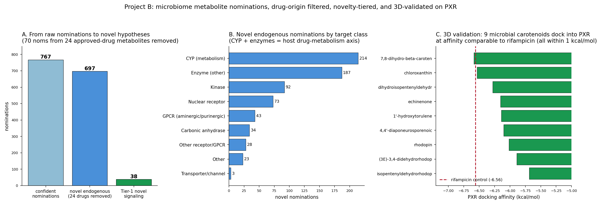

# Structure-validated target nomination for microbial metabolites reveals a carotenoid-PXR axis

James K. Martin II, PhD^1,*^

^1^ Department of Medical Education and Scholarship, Rowan-Virtua School of Osteopathic Medicine, Stratford, NJ, USA

*Correspondence: martiniij@rowan.edu

*Preprint, not peer reviewed.*

## Abstract

Microbes produce metabolites that signal to human receptors, but most metabolite-to-target relationships have been found one axis at a time. We asked whether a reliability-aware, similarity-plus-structure target-transfer pipeline, the framework used in our companion antimicrobial work, can nominate host targets for microbial metabolites systematically and in the forward direction. Applied to 1,537 microbial-origin metabolites from ChEBI, the pipeline produced 16,849 metabolite-to-target nominations, of which 2,415 sit above an "analog wall" at Tanimoto 0.5 and are treated as confident. It recovered 3 of 3 testable known axes above the wall: niacin to HCAR2 (similarity 1.00), and a secondary bile acid to FXR and to TGR5 (both 0.59). From 767 confident nominations (310 metabolites, 100 targets), a structural drug-origin filter (Tanimoto >= 0.98 to any of 3,417 approved drugs) removed 24 metabolites structurally identical to Streptomyces pharmaceuticals, which recover known pharmacology, not novel biology. The remaining novel set (697 nominations, 286 metabolites, 99 targets) is dominated by drug- and xenobiotic-metabolism targets: cytochrome P450 (214) and other enzymes (187), then kinases, nuclear receptors, and GPCRs. Its strongest signal is a cluster of 9 microbial carotenoids that all nominate the xenobiotic-sensing receptor PXR (NR1I2) at 2D similarity 0.64 to 0.88. Docking these carotenoids and the canonical agonist rifampicin into human PXR (PDB 1NRL) placed every one within 1 kcal/mol of rifampicin, so the nomination holds structurally, not only by similarity. Drug-origin filtering and 3D validation make this carotenoid-PXR convergence a concrete, testable hypothesis for how a microbial biosynthetic family may modulate host drug metabolism.

## 1. Introduction

The metabolites made by host-associated and environmental microbes are increasingly recognized as signaling molecules that act on human receptors and enzymes. The best-characterized examples are now textbook: short-chain fatty acids acting on FFAR2/3, secondary bile acids on FXR and the membrane receptor TGR5, and tryptophan-derived indoles on the aryl hydrocarbon receptor. What these examples share is how they were found: one axis at a time, each the product of a dedicated study. The space of microbial metabolites is far larger than the set of characterized axes, and most microbial metabolites have no annotated human target at all.

The obstacle is not conceptual but practical. Given a microbial metabolite structure, which of the hundreds of ligand-backed human targets is it most likely to engage? Answering this one metabolite at a time by assay is slow, and many microbial metabolites are difficult to procure in quantity, which makes brute-force screening impractical. A computational nomination step that ranks candidate targets for a given structure would let experimental effort be spent where a prior hypothesis already exists.

Here we apply a reliability-aware, similarity-plus-structure target-transfer pipeline in the discovery direction. The pipeline was built and validated for antimicrobial natural-product target prediction in a companion paper; the contribution of the present work is the human/host-metabolism application and, critically, a downstream analysis that separates nominations recovering known drug pharmacology from genuinely novel endogenous hypotheses, then validates the strongest novel signal structurally. The result is a systematic, drug-origin-filtered, structure-validated map of candidate microbiome-to-host interactions, with one concrete flagship hypothesis: a whole carotenoid biosynthetic family converging on the xenobiotic receptor PXR.

## 2. Methods

### 2.1 Microbial-metabolite input set

We assembled 1,537 microbial-origin metabolites from ChEBI [2] microbial-origin annotations. This ChEBI-only sourcing is a deliberate but consequential choice: HMDB and MiMeDB were unreachable during curation, so the input contains essentially no indole or tryptophan metabolites. That gap is discussed as a limitation, because it removes one of the classic microbiome-to-host axes from what the method could possibly recover.

### 2.2 Nomination pipeline and the analog wall

Target nomination uses Morgan-fingerprint [1] nearest-neighbor transfer over a benchmark of 319 human protein targets backed by ChEMBL [3] and BindingDB ligands. For each query metabolite, the nearest ligand-backed neighbor for a target defines a transferred nomination, scored by 2D Tanimoto similarity. Reliability is enforced by an "analog wall" at Tanimoto 0.5: nominations at or above the wall have a close structural analog in the target's known ligand set and are labeled confident; nominations below the wall are structural orphans and are retained but flagged. Applied to the 1,537-metabolite set, the pipeline produced 16,849 nominations, 2,415 above the wall and 14,434 below.

### 2.3 Positive-control panel

To check that the forward direction recovers established biology, we assembled a panel of known microbiome-to-host axes and asked whether each recovers above the wall. Three axes were testable given the input: niacin/nicotinic acid to HCAR2 (GPR109A); the secondary bile acid 7,12-dioxolithocholic acid to FXR; and the same bile acid to TGR5 (GPBAR1). Two further axes were untestable and were recorded as such rather than scored: short-chain fatty acids to FFAR2/3 (the acids are too small for meaningful Tanimoto matching, and FFAR2/3 are absent from the ligand-backed target universe), and indole/tryptophan to AhR/PXR (the ChEBI input contained essentially no indole or Trp metabolites).

### 2.4 Drug-origin filter

Many microbial metabolites are themselves approved drugs or are structurally identical to them, because a large fraction of clinical antibiotics and immunosuppressants are Streptomyces products. A nomination that transfers such a metabolite onto its own known target recovers established pharmacology, not new biology. To separate these, we fingerprinted the confident metabolites against 3,417 approved ChEMBL drugs (max_phase = 4) and flagged any metabolite with Morgan-fingerprint Tanimoto >= 0.98 to an approved drug as drug-origin.

### 2.5 Novelty tiering

The novel endogenous nominations were tiered by how specific and interpretable each is. Tier 1 requires a signaling-receptor target, a metabolite that hits fewer than 4 targets (specificity), and similarity >= 0.55. Tier 2 and Tier 3 relax these criteria in turn.

### 2.6 PXR docking

The flagship carotenoid-to-PXR cluster was validated in 3D. We docked all 9 cluster carotenoids plus rifampicin, the canonical human PXR agonist positive control, into the human PXR ligand-binding domain (PDB 1NRL), with the search box centered on the co-crystallized SR12813 ligand, using AutoDock Vina [4] at exhaustiveness 8.

### 2.7 Disease bridge

To connect nominations to therapeutic relevance, novel targets (drug-origin excluded) were mapped to disease associations via Open Targets [5], producing metabolite-to-target-to-disease triples.

## 3. Results

### 3.1 Positive-control recovery

All 3 of the 3 testable known axes recovered above the analog wall. Niacin to HCAR2 recovered at similarity 1.00, an exact structural match, and both secondary-bile-acid axes, to FXR and to TGR5, recovered at 0.59. The two untestable axes (SCFA to FFAR2/3, indole/Trp to AhR/PXR) failed for reasons intrinsic to the input and target universe rather than to the model: the SCFAs are too small for Tanimoto matching and their receptors are not in the ligand-backed set, and the indole/Trp metabolites were essentially absent from the ChEBI input. Recovering the testable axes and correctly attributing the untestable ones to input gaps gives confidence that above-wall nominations reflect real structural relationships.

### 3.2 The drug-origin filter and the novel set

Of the 767 confident nominations carried forward (310 distinct metabolites, 100 targets), the drug-origin filter flagged 24 metabolites (70 nominations) as structurally identical (Tanimoto >= 0.98) to approved drugs, including kanamycin, tetracyclines, rifampicin, tacrolimus, sirolimus, and doxorubicin. These are Streptomyces-produced pharmaceuticals whose nominations recover the drug's known target; they are validation that the pipeline transfers correctly, but they are not novel biology, and we separated them out. The remaining novel endogenous set is 697 nominations across 286 metabolites and 99 targets. Novelty tiering placed 38 nominations in Tier 1, 212 in Tier 2, and 447 in Tier 3.

### 3.3 Target-class composition: a drug-metabolism theme

The novel nominations are not spread evenly across target classes. The two largest classes are cytochrome P450 metabolism (214 nominations) and other enzymes (187), which together account for the majority of the novel set. The next classes are kinases (92), nuclear receptors (73), and GPCRs (43). The dominance of P450 and other metabolic enzymes points to a coherent theme: a large share of the systematic microbiome-to-host signal in this set concerns host drug and xenobiotic metabolism rather than classical hormone- or neurotransmitter-like signaling.

### 3.4 Flagship hypothesis: a carotenoid family converging on PXR

The strongest novel signal is a structurally related cluster of 9 microbial carotenoid and polyene metabolites, all nominating the xenobiotic-sensing nuclear receptor PXR (NR1I2) at 2D similarity 0.64 to 0.88. PXR is the receptor that regulates host CYP3A4, so a carotenoid-to-PXR link ties directly to the drug-metabolism theme above. The cluster comprises rhodopin, 4,4'-diaponeurosporenoic acid, chloroxanthin, (3E)-3,4-didehydrorhodopin, isopentenyldehydrorhodopin, dihydroisopentenyldehydrorhodopin, 7,8-dihydro-beta-carotene, echinenone, and 1'-hydroxytorulene. Lasalocid, a polyether ionophore, is a separate PXR nomination but is not a carotenoid and is excluded from this cluster. What makes the cluster compelling is not any single nomination but the convergence: an entire biosynthetic family arriving at the same xenobiotic receptor.

### 3.5 3D validation of the flagship

To test whether the carotenoid-to-PXR nomination holds beyond 2D similarity, we docked all 9 carotenoids and the rifampicin positive control into the human PXR ligand-binding domain (PDB 1NRL). All 9 carotenoids docked in the range -5.69 to -6.59 kcal/mol (median -6.14), against a rifampicin control of -6.56. Every one of the 9 fell within 1 kcal/mol of the rifampicin control, and 7,8-dihydro-beta-carotene (-6.59) was marginally stronger than rifampicin. The carotenoid-to-PXR nomination therefore survives a structural test, not only 2D fingerprint similarity.

**Figure 1.** Downstream analysis of the microbiome-to-host nominations. (A) Nomination waterfall from the raw confident set through removal of the 24 drug-origin metabolites to the novel endogenous set and the Tier-1 nominations. (B) Novel nominations by target class, dominated by cytochrome P450 and other enzymes. (C) Docking scores for the 9 carotenoids in the human PXR ligand-binding domain against the rifampicin control line; all 9 fall within 1 kcal/mol of the control.

### 3.6 Disease bridge

Mapping the novel targets (drug-origin excluded) to disease through Open Targets produced 470 metabolite-to-target-to-disease triples across 94 targets. The top therapeutic areas were genetic/congenital disease (48 triples), nervous-system disease (47), immune disease (34), cancer (29), cardiovascular disease (27), and endocrine disease (27). Two strong signaling triples illustrate the kind of specific hypothesis the bridge surfaces: 4,4'-diaponeurosporenoic acid to the progesterone receptor to endometriosis (association 0.67), and ascomycin to the adenosine A3 receptor to migraine (0.61).

## 4. Discussion

The contribution here is a systematic and reliability-aware way to nominate human targets for microbial metabolites in the forward direction, coupled to a downstream analysis that does two things most similarity-based nomination pipelines do not. First, it explicitly separates nominations that merely recover the known pharmacology of drug-identical metabolites from genuinely novel endogenous hypotheses. Because a large fraction of microbial metabolites are or resemble approved Streptomyces-derived drugs, this filter is not cosmetic: 24 metabolites and 70 nominations of the confident set would otherwise masquerade as discovery. Second, it validates the strongest novel signal structurally rather than resting on 2D similarity alone.

The carotenoid-to-PXR flagship is the clearest product of this discipline. A whole family of microbial carotenoids and polyenes converges on the xenobiotic receptor that controls host CYP3A4, the nomination holds across 2D similarity (0.64 to 0.88) and 3D docking (all within 1 kcal/mol of rifampicin), and it sits inside a broader, independently observed theme in the data: the novel nominations are dominated by drug- and xenobiotic-metabolism targets. The coherent reading is that this microbial metabolite set signals to the host largely through the machinery of drug metabolism, and that carotenoids may be one endogenous input to that machinery through PXR.

This application shares its framework with the companion antimicrobial paper. There the pipeline nominated microbial targets for natural products; here it nominates host targets for microbial metabolites. The same analog-wall reliability control and the same similarity-plus-structure logic carry over, which is itself evidence that the framework generalizes across the two directions of the natural-product target-nomination problem.

## 5. Limitations

These are nominations, not validated ligands. Both the 2D similarity transfer and the docking are computational hypotheses that require biochemical assay to confirm.

Carotenoids are lipophilic and somewhat promiscuous. The named cluster metabolites each hit between 4 and 10 targets (mean about 5.3), so no single carotenoid-to-PXR nomination is individually decisive. The value of the flagship lies in the convergence of a whole biosynthetic family on one xenobiotic receptor, which makes it a hypothesis worth testing, not a proof of binding.

The microbial-metabolite input was ChEBI-only because HMDB and MiMeDB were unreachable during curation. As a direct consequence, indole and tryptophan metabolites are essentially absent, so the indole/Trp-to-AhR/PXR axis could not be recovered. This is a known input gap, not a model failure, but it means the map is incomplete in a way that specifically omits one classic microbiome-to-host axis.

Finally, the positive-control panel is small (3 testable axes) because so few known axes are simultaneously present in the input and backed by ligands in the target universe. The recovery is encouraging but not a large-scale benchmark.

## 6. Conclusion

Applying a reliability-aware, similarity-plus-structure target-transfer pipeline in the discovery direction to 1,537 microbial metabolites produced 16,849 host-target nominations, of which the confident, drug-origin-filtered subset yields 697 novel endogenous nominations across 286 metabolites and 99 targets. The novel set is dominated by drug- and xenobiotic-metabolism targets, and its strongest signal is a cluster of 9 microbial carotenoids converging on the xenobiotic receptor PXR, a nomination that survives both 2D similarity and 3D docking against a rifampicin control. The work delivers a systematic, filtered, and partly structure-validated map of candidate microbiome-to-host interactions, and one concrete, testable hypothesis about how a microbial biosynthetic family may modulate host drug metabolism.

## 7. References

1. Rogers D, Hahn M. Extended-connectivity fingerprints. *J Chem Inf Model.* 2010;50(5):742-754. doi:10.1021/ci100050t
2. ChEBI: Chemical Entities of Biological Interest database. EMBL-EBI. https://www.ebi.ac.uk/chebi/
3. Zdrazil B, Felix E, Hunter F, et al. The ChEMBL Database in 2023: a drug discovery platform spanning multiple bioactivity data types and time periods. *Nucleic Acids Res.* 2024;52(D1):D1180-D1192. doi:10.1093/nar/gkad1004
4. Eberhardt J, Santos-Martins D, Tillack AF, Forli S. AutoDock Vina 1.2.0: new docking methods, expanded force field, and Python bindings. *J Chem Inf Model.* 2021;61(8):3891-3898. doi:10.1021/acs.jcim.1c00203
5. Ochoa D, Hercules A, Carmona M, et al. The next-generation Open Targets Platform: reimagined, redesigned, rebuilt. *Nucleic Acids Res.* 2023;51(D1):D1353-D1359. doi:10.1093/nar/gkac1046
