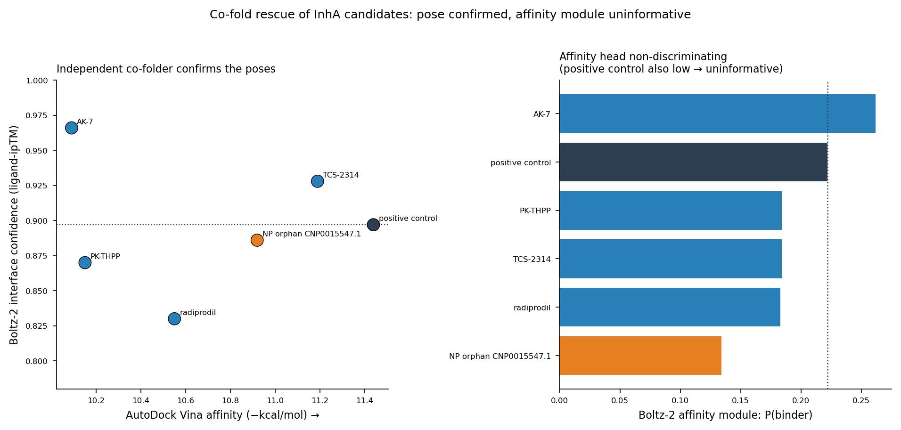

# The Analog Wall: reliability-aware target prediction for natural products, drug repurposing, and antimicrobial resistance

An open, end-to-end pipeline that predicts protein targets for small molecules,
**quantifies where it stops being trustworthy**, and **extends to whether a
nominated antimicrobial target survives resistance mutations**. Built and
orchestrated with Claude for the *Built with Claude, Life Sciences* hackathon.

---

## TL;DR

Chemical-similarity target prediction is everywhere in drug discovery, but it has a
failure boundary nobody measures. We measured it: across **695,133 natural products**
(COCONUT 2.0), **~63% are "true structural orphans"** with no close analog among known
binders, and similarity-based prediction provably cannot reach them. The cliff is
sharp, at a Tanimoto coefficient of ~0.5. We call it **the analog wall**.

We then built a pipeline that respects the wall, nominating targets *with a
calibrated confidence score* and **structurally validating below-wall predictions
by docking with real controls**, and pointed the *same* pipeline at three problems:
**natural-product discovery**, **drug repurposing**, and **antimicrobial resistance**.

**Headline result:** a natural-product orphan and an FDA-approved drug, chemically
unrelated, **converge on the same antibacterial target (*M. tuberculosis* InhA)**
through one identical validation standard; and a mutant-aware ΔΔG layer then
nominates natural products predicted **more resistance-robust than the front-line
drug** on that target family.


Two papers report the work: **`PAPER.md`** (the antimicrobial framework and its
resistance extension) and **`PROJECT_B_PAPER.md`** (a standalone application to
microbiome-metabolite target nomination, flagship result: a cluster of microbial
carotenoids converging on the xenobiotic receptor PXR, structurally validated by
docking).

---

## The three-layer story

### Impact, the repurposing blind spot
We ran **8,780 approved/clinical drugs × 319 targets → 131,700 predictions**.
**1,218 drugs have credible pathogen-target predictions *below* the analog wall** , 
latent antibacterial/antiviral hypotheses that standard similarity screens
systematically miss (1,023 bacterial, 180 viral, plus fungal/parasitic).


### Takeaway, one standard, two discovery worlds
Docking the deepest below-wall drugs against SIFTS-verified bacterial receptors,
**InhA is a reproducible hit target**: 6 candidates dock −9.1 to −11.2 kcal/mol,
4 clear the 5th-percentile of a property-matched **decoy distribution
(enrichment p = 0.0004)**, and 5 of 6 engage the catalytic **Tyr158**. The two
other targets (TEM-1 β-lactamase, *E. coli* DHFR) correctly reject their
nominations, the QC filters as well as it finds.


A true natural-product orphan from the original library (CNP0015547.1, nn = 0.41)
docks −10.9 on the same scale, beating the positive control, converging with the
repurposed drugs.

**Orthogonal co-fold check.** Re-folding the InhA candidates with an independent
structure predictor (Boltz-2) corroborates the docking *poses*: all six ligands,
including the natural-product orphan, place in the InhA pocket with interface
confidence (ligand-ipTM 0.83–0.97) comparable to the known-inhibitor positive
control. Boltz-2's affinity module was non-discriminating here (it scored the
positive control as low as the candidates), so we read the co-fold as
pose-level support only, not added binding evidence.



### Extension, resistance-aware nomination
Rigid docking is provably blind to resistance: known drugs show ΔΔG ≈ 0 against
their own resistance mutations. So we built a **curated mutant-aware target
database** (10 priority pathogen targets, 76 resistance mutations, all X-ray
structures) and a **control-validated ΔΔG layer** (mCSM-lig class) that passes the
positive-control gate rigid docking fails: it correctly recovers the destabilizing
effect of trimethoprim resistance (*S. aureus* DHFR-F98Y) and pyrimethamine
resistance (*P. falciparum* DHFR-S108N) leave-target-out. Screening **163
below-wall orphans over 626 ligand–mutation pairs** across the nine targets that
yield scorable complexes, a subset of natural products is predicted **more
resistance-robust than the front-line drug**, led on the validated DHFR family by
**seven orphans below the trimethoprim-class control's worst-case liability**.


### Foundation, the wall and the honest instrument
Everything rests on the quantified analog wall and a reliability-aware two-stage
pipeline. The wall is **source-independent** (reproduces on NP Atlas / CMAUP gap
compounds), a property of the method, not any dataset.


---

## What is (and isn't) novel

Component methods are **not** new, similarity NP target prediction, reverse-docking
target fishing, cold-start DTI, and reliability-scored repurposing all exist
(MolTarPred, TarFisDock, and others; see [`docs/LITERATURE_POSITIONING.md`](docs/LITERATURE_POSITIONING.md)).
Our contribution is **integration + honesty + openness**:

- the **quantified analog wall** at 695k scale (a measured boundary, not a vague caveat);
- **failure-mode QC that caught real errors live** (SIFTS identity + controls + decoy enrichment);
- **one validation standard** across discovery and repurposing;
- a **resistance-aware extension** (curated mutant-aware target database + control-validated ΔΔG layer) that no existing resource provides for pathogen targets linked to an orphan library;
- **fully open tooling** where comparable work is patented or web-server-gated.

**The boundary we do not cross:** docking + enrichment + catalytic contacts is a
*computational hypothesis*, not proof of binding. Every molecule here is a
structurally prioritized **nomination for follow-up**, never a claimed drug. A
CO-ADD whole-cell validation gave an honest **null** (nomination score does not
predict phenotype, the target–phenotype gap), which is exactly *why* target-level
structural validation is the right instrument.

---

## Repository layout

```
figures/    all publication figures (PNG)
data/       result tables (CSV) + docked/co-folded complexes (PDB)
docs/        writeups, preprint, and forward-looking design docs
```

### Documents
| file | what it is |
|---|---|
| `PAPER.md` / `PAPER.pdf` | main preprint: the antimicrobial framework and its resistance-aware extension (Abstract, Methods, Results, Discussion, Limitations, numbered references) |
| `PROJECT_B_PAPER.md` / `PROJECT_B_PAPER.pdf` | standalone short paper: microbiome-metabolite target nomination, flagship carotenoid to PXR axis with 3D validation |
| `SUBMISSION.md` | hackathon submission writeup (demo-forward framing across all arms) |
| `docs/LITERATURE_POSITIONING.md` | honest positioning against prior art (MolTarPred, TarFisDock, cold-start DTI) |
| `docs/future_directions.md` | ranked next-project directions, grounded in literature/tools |
| `docs/AD_FRAMEWORK_PITCH.md` | design doc: adapting the framework to neurodegenerative-disease targets (with a candid crowdedness verdict) |

### Key data files
| file | what it is |
|---|---|
| `data/repurposing_map.csv` | 3,373 drugs, reliability-tagged pathogen nominations |
| `data/repurposing_docking_combined.csv` | below-wall drugs docked vs bacterial targets + controls |
| `data/decoy_enrichment_results.csv` | enrichment stats vs property-matched decoys, all 3 targets |
| `data/inha_pose_contacts.csv` | catalytic-residue contacts per candidate |
| `data/np_orphan_inha_validation.csv` | NP orphans docked vs InhA on the shared scale |
| `data/coadd_validation_result.csv` | CO-ADD experimental null result |
| `data/method_validation_orphan_recall.csv` | fusion-vs-similarity orphan recall (method validation) |
| `data/inha_TCS2314_complex.pdb` | InhA + top docked pose (open in any viewer) |

---

## Reproducibility & honesty

Every number in the writeup traces to a table in `data/`. Data sources: COCONUT 2.0,
ChEMBL, Broad Drug Repurposing Hub, CO-ADD-derived screening data, RCSB PDB. Docking:
AutoDock Vina. Receptor identity: SIFTS/PDBe. This work was produced during a
hackathon; results are computational hypotheses intended to be reproduced, scrutinized,
and, for the InhA candidates, followed up with free-energy simulation and wet-lab
enzyme assays.

*Built with Claude.*
